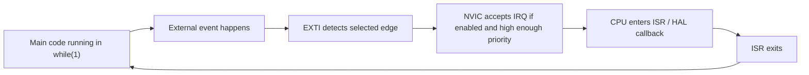
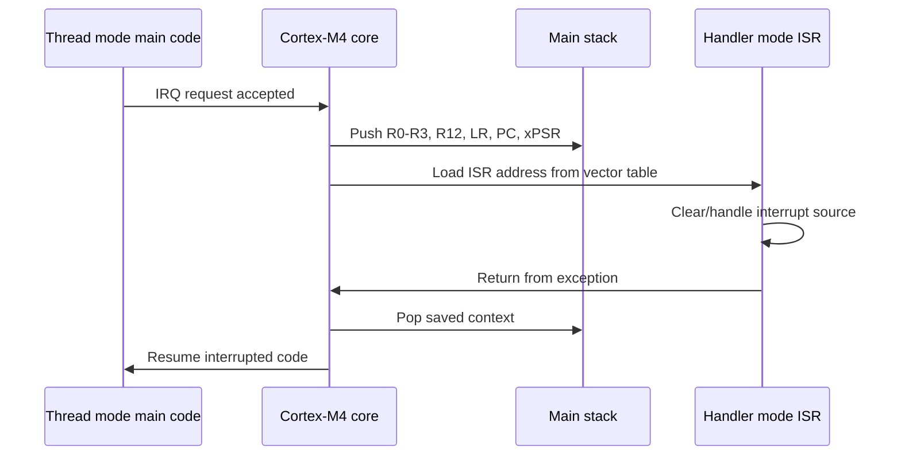
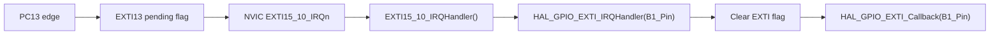
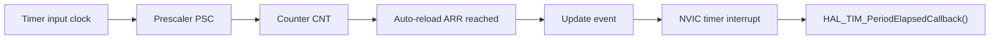
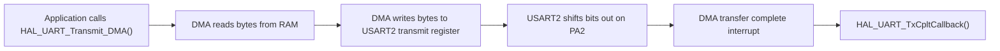
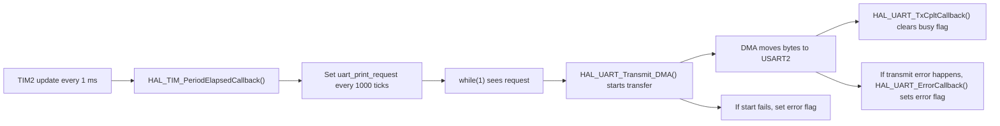

# STM32 Interrupts, Timers, DMA, And DWT Counter

## Table Of Contents

- [Goals](#goals)
- [1. Interrupt Basics](#1-interrupt-basics)
- [2. Timer Basics](#2-timer-basics)
- [3. DMA Basics](#3-dma-basics)
- [4. DWT Cycle Counter](#4-dwt-cycle-counter)

## Goals

The goal is to understand the basic of:

1. Interrupts
2. Timer interrupts
3. DMA
4. DWT cycle counter

These topics are important because they let the STM32 react to events and handle timing without relying only on `while (1)` and `HAL_Delay()`.

## 1. Interrupt Basics

### Goal

Learn how the STM32 Cortex-M4 reacts to an event, jumps into an interrupt service routine, then returns to the main program with the CPU context restored.

### What To Learn

- What an interrupt is.
- The difference between polling and interrupt-driven code.
- Thread mode vs handler mode.
- What the NVIC does.
- What the EXTI controller does.
- What the interrupt vector table is.
- What happens during interrupt entry and return.
- Why ISR code must be short and deterministic.
- How CubeMX connects GPIO EXTI, NVIC, and HAL callback code.

### Polling vs Interrupts

Polling means the CPU repeatedly checks a condition:

```c
while (1)
{
    if (HAL_GPIO_ReadPin(B1_GPIO_Port, B1_Pin) == GPIO_PIN_RESET)
    {
        HAL_GPIO_TogglePin(LD2_GPIO_Port, LD2_Pin);
    }
}
```

Interrupt-driven code lets hardware notify the CPU only when the event happens.



### Cortex-M Interrupt Flow

On Cortex-M, interrupt entry and return are partly handled by hardware. When an enabled interrupt is accepted, the core saves important registers on the stack, loads the ISR address from the vector table, runs the handler, then restores the saved context.

Registers automatically stacked on exception entry include:

- `R0`, `R1`, `R2`, `R3`: general-purpose working registers. Function arguments and temporary values are often stored here.
- `R12`: another temporary working register, also called the intra-procedure-call scratch register.
- `LR`: link register. It normally stores the return address when a function call happens. During interrupt handling, it stores special exception-return information.
- `PC`: program counter. It stores the address of the next instruction the CPU should execute. Saving `PC` lets the CPU return to the interrupted code.
- `xPSR`: program status register. It stores CPU state information such as condition flags and execution state.



### NVIC And EXTI

The STM32 external interrupt path has two main blocks:

- `EXTI`: detects edges on external interrupt lines.
- `NVIC`: enables, prioritizes, and dispatches interrupt requests to the CPU.

For a GPIO button interrupt:

```text
Button pin edge -> EXTI line pending bit -> NVIC IRQ -> IRQ handler -> HAL callback
```

GPIO EXTI lines are shared by pin number. For example:

```text
PA0, PB0, PC0 ... can map to EXTI0
PA1, PB1, PC1 ... can map to EXTI1
PC13 maps to EXTI13
```

Only one GPIO port can be selected for the same EXTI line at a time. So `PA0` and `PB0` cannot both independently use `EXTI0` at the same time.

For the NUCLEO-F446RE blue button:

```text
PC13 -> EXTI13 -> EXTI15_10_IRQn -> EXTI15_10_IRQHandler() -> HAL_GPIO_EXTI_Callback()
```

### Priority, Pending, And Active States

An interrupt can be roughly thought of as:

- `Inactive`: no event waiting and ISR not running.
- `Pending`: event occurred, but ISR has not run yet.
- `Active`: ISR is currently running.
- `Active and pending`: ISR is running and another event from the same source is waiting.

Priority matters when multiple interrupts happen. Lower numeric priority means higher urgency in ARM Cortex-M systems.

```text
Priority 0 is higher than priority 1.
Priority 1 is higher than priority 2.
```

A higher-priority interrupt can preempt a lower-priority ISR. Same-priority interrupts do not preempt each other; one waits until the current ISR finishes.

### HAL / CubeMX Code Path

CubeMX usually generates the real IRQ handler in `stm32f4xx_it.c`. For the blue button on `PC13`, the handler is usually:

```c
void EXTI15_10_IRQHandler(void)
{
    HAL_GPIO_EXTI_IRQHandler(B1_Pin);
}
```

Then the HAL clears the EXTI pending flag and calls the user callback:

```c
void HAL_GPIO_EXTI_Callback(uint16_t GPIO_Pin)
{
    if (GPIO_Pin == B1_Pin)
    {
        // user code here
    }
}
```

In CubeMX, the configuration is:

```text
PC13 mode: GPIO_EXTI13
Trigger: falling edge
NVIC: EXTI line[15:10] interrupt enabled
```

### External Interrupt Setup Flow

The basic external interrupt workflow is:

1. Configure one GPIO pin as an output LED.
2. Configure one GPIO pin as an external interrupt input.
3. Select the interrupt trigger edge: rising, falling, or both.
4. Enable the correct EXTI interrupt in NVIC.
5. Generate code.
6. Find the generated IRQ handler in `stm32f4xx_it.c`.
7. Write the application behavior in `HAL_GPIO_EXTI_Callback()`.

For this NUCLEO-F446RE project, the mapping is:

```text
LED output             -> LD2 on PA5
Button input           -> B1 on PC13
PC13 interrupt line    -> EXTI13
NVIC IRQ group         -> EXTI15_10_IRQn
Generated IRQ handler  -> EXTI15_10_IRQHandler()
User callback          -> HAL_GPIO_EXTI_Callback()
```

Generated interrupt path:



The HAL function `HAL_GPIO_EXTI_IRQHandler()` checks whether the EXTI flag is set, clears the interrupt flag, then calls the user callback. This is why most user code should go in:

```c
void HAL_GPIO_EXTI_Callback(uint16_t GPIO_Pin)
{
    if (GPIO_Pin == B1_Pin)
    {
        // user response to PC13 interrupt
    }
}
```

Toggling an LED directly inside the callback is acceptable for a very small demonstration:

```c
void HAL_GPIO_EXTI_Callback(uint16_t GPIO_Pin)
{
    if (GPIO_Pin == B1_Pin)
    {
        HAL_GPIO_TogglePin(LD2_GPIO_Port, LD2_Pin);
    }
}
```

For cleaner embedded design, especially once UART, timers, DMA, or control logic are added, use the callback to set a flag and let `while (1)` handle the work:

```c
volatile uint8_t button_event = 0;

void HAL_GPIO_EXTI_Callback(uint16_t GPIO_Pin)
{
    if (GPIO_Pin == B1_Pin)
    {
        button_event = 1;
    }
}
```

### Interrupt Response Time

Interrupt response time is the time between the input edge and the output reaction.

```text
response time = hardware interrupt latency
              + context save time
              + vector fetch
              + HAL handler overhead
              + user callback execution
              + GPIO output write time
```

With an oscilloscope or logic analyzer, this can be measured by comparing:

```text
Channel 1: button/input signal
Channel 2: LED/output pin signal
```

Using HAL is convenient and readable, but it adds function-call overhead. Direct register access can reduce latency, but HAL is better for learning and for many normal applications.

### Example: Toggle LED After Press And Release

This example uses the blue button as an external interrupt input. A complete button action means the button is pressed and then released. After one complete press-release cycle, `LD2` toggles once.

```text
Press blue button.
Release blue button.
LD2 toggles once.
```

The interrupt callback only records that a button edge happened. The main loop waits a short debounce time, reads the real button level, and toggles the LED only after it sees a valid press followed by a release.

For the NUCLEO-F446RE button:

```text
PC13 not pressed = GPIO_PIN_SET
PC13 pressed     = GPIO_PIN_RESET
```

#### CubeMX Configuration

Open the `.ioc` file and configure:

```text
PC13:
  Mode  = GPIO_EXTI13
  GPIO mode = External Interrupt Mode with Rising/Falling edge trigger detection
  Pull = No pull-up and no pull-down
  Label = B1

PA5:
  Mode = GPIO_Output
  Label = LD2

NVIC:
  Enable EXTI line[15:10] interrupts
```

Why both edges?

```text
Falling edge = button press
Rising edge  = button release
```

#### Code

Add this in `USER CODE BEGIN PV`:

```c
volatile uint8_t button_event = 0;
volatile uint32_t button_event_time = 0;
uint8_t pressed = 0;
```

Add this in `USER CODE BEGIN 2`:

```c
HAL_GPIO_WritePin(LD2_GPIO_Port, LD2_Pin, GPIO_PIN_RESET);
```

Add this in `USER CODE BEGIN WHILE`, inside `while (1)`:

```c
if ((button_event != 0) && ((HAL_GetTick() - button_event_time) >= 30))
{
    button_event = 0;

    if (HAL_GPIO_ReadPin(B1_GPIO_Port, B1_Pin) == GPIO_PIN_RESET)
    {
        pressed = 1;
    }
    else if (pressed != 0)
    {
        pressed = 0;
        HAL_GPIO_TogglePin(LD2_GPIO_Port, LD2_Pin);
    }
}
```

This waits `30 ms` after the interrupt before trusting the button level. That helps avoid false toggles from mechanical bounce.

Add this in `USER CODE BEGIN 4`:

```c
void HAL_GPIO_EXTI_Callback(uint16_t GPIO_Pin)
{
    if (GPIO_Pin == B1_Pin)
    {
        button_event = 1;
        button_event_time = HAL_GetTick();
    }
}
```

Expected behavior:

```text
Press and release once -> LD2 toggles ON
Press and release again -> LD2 toggles OFF
Press and release again -> LD2 toggles ON
```

The LED does not follow the held button level. It changes state once per complete press-release cycle.

### Why `volatile` Is Used

```c
volatile uint8_t button_event = 0;
```

`volatile` tells the compiler that this variable can change outside the normal program flow. Here, `button_event` is written inside an interrupt and read inside `while (1)`, so the compiler must not optimize away repeated reads.

### ISR Design Rules

Good ISR code:

- Clear or acknowledge the interrupt source when needed.
- Set a flag for the main loop.
- Copy a small amount of data.
- Keep execution time predictable.

Avoid inside ISR code:

- Long `HAL_Delay()` calls.
- Blocking UART prints.
- Large loops.
- Heavy calculations.
- Waiting for another interrupt-dependent event.

### Key Idea

```text
Interrupts are hardware-triggered control-flow changes.
EXTI detects the external edge.
NVIC decides whether and when the CPU services it.
The Cortex-M core saves context, runs the ISR, then restores context.
The ISR should be short; the main loop should do the heavier work.
```

## 2. Timer Basics

### Goal

Learn how STM32 hardware timers generate accurate periodic events without blocking the CPU with `HAL_Delay()`.

### What To Learn

- Timer clock source from the APB clock tree.
- Prescaler register, usually called `PSC`.
- Auto-reload register / counter period, usually called `ARR`.
- Counter register, usually called `CNT`.
- Update event, which happens when the counter overflows.
- Timer interrupt, which lets software react to the update event.
- Difference between timer base mode, PWM mode, input capture, and output compare.

### Core Idea

A timer is a hardware counter. It counts clock ticks independently from the CPU. When the counter reaches the auto-reload value, it can reset and generate an update event. If the update interrupt is enabled, the CPU jumps into a timer interrupt callback.



### Timer Frequency Formula

For an up-counting timer:

```text
timer_update_frequency = timer_clock / ((PSC + 1) * (ARR + 1))
```

Rearranged:

```text
timer_period_seconds = ((PSC + 1) * (ARR + 1)) / timer_clock
```

Example if the timer clock is `84 MHz`:

```text
PSC = 8399
ARR = 9999

timer_update_frequency = 84,000,000 / ((8399 + 1) * (9999 + 1))
                       = 84,000,000 / (8400 * 10000)
                       = 1 Hz
```

So the timer interrupt runs once per second.

### Important Clock Detail

On STM32F4, timer clocks are connected to APB buses. If the APB prescaler is greater than `1`, the timer clock is usually doubled compared with the APB peripheral clock.

For this project:

```text
SYSCLK = 84 MHz
APB1 peripheral clock = 42 MHz
APB1 timer clock = 84 MHz
```

This is why TIM2/TIM3/TIM4/TIM5 can still receive an `84 MHz` timer clock even though APB1 itself is `42 MHz`.

### Timer Interrupt Code Path

For a timer interrupt, the code flow is similar to GPIO EXTI:

```text
Timer update event
-> TIMx IRQ
-> TIMx_IRQHandler()
-> HAL_TIM_IRQHandler()
-> HAL_TIM_PeriodElapsedCallback()
```

In user code, the important callback is:

```c
void HAL_TIM_PeriodElapsedCallback(TIM_HandleTypeDef *htim)
{
    if (htim->Instance == TIM2)
    {
        // timer event code here
    }
}
```

The `if (htim->Instance == TIM2)` check matters because multiple timers share the same callback function.

### Example: Blink LD2 Every 500 ms Using TIM2

This example uses TIM2 as a periodic interrupt source. The timer interrupt runs every `1 ms`, and the code toggles `LD2` every `500` timer ticks.

#### CubeMX Configuration

Configure TIM2:

```text
TIM2:
  Clock Source = Internal Clock
  Prescaler = 83
  Counter Period = 999
  Counter Mode = Up

NVIC:
  Enable TIM2 global interrupt
```

With an `84 MHz` TIM2 clock:

```text
timer_update_frequency = 84,000,000 / ((83 + 1) * (999 + 1))
                       = 84,000,000 / 84,000
                       = 1000 Hz
```

So TIM2 creates one interrupt every `1 ms`.

#### Code

Add this in `USER CODE BEGIN PV`:

```c
volatile uint32_t tim2_ms_counter = 0;
```

Add this in `USER CODE BEGIN 2`:

```c
HAL_TIM_Base_Start_IT(&htim2);
```

Add this in `USER CODE BEGIN 4`:

```c
void HAL_TIM_PeriodElapsedCallback(TIM_HandleTypeDef *htim)
{
    if (htim->Instance == TIM2)
    {
        tim2_ms_counter++;

        if (tim2_ms_counter >= 500)
        {
            tim2_ms_counter = 0;
            HAL_GPIO_TogglePin(LD2_GPIO_Port, LD2_Pin);
        }
    }
}
```

Expected behavior:

```text
LD2 toggles every 500 ms.
One full ON-OFF cycle takes 1 second.
```

### Timer Interrupt vs HAL_GetTick

`HAL_GetTick()` normally uses the Cortex-M `SysTick` timer to provide a global millisecond counter for HAL. A TIM2 interrupt is different because it is a peripheral timer that I configure for my own application.

```text
HAL_GetTick() / SysTick = HAL system time
TIM2 interrupt          = application-defined periodic event
```

Use `HAL_GetTick()` for simple elapsed-time checks. Use a TIMx interrupt when the application needs a dedicated periodic task, precise sampling rate, PWM timing, input capture, or hardware-triggered peripheral behavior.

### Key Idea

```text
A timer is hardware that counts independently from the CPU.
PSC divides the timer clock.
ARR defines when the counter overflows.
The update event can trigger an interrupt.
Timer interrupts are useful for periodic work without blocking the main loop.
```

## 3. DMA Basics

### Goal

Learn how DMA can move data between memory and peripherals without the CPU manually copying every byte.

### What To Learn

- What DMA means.
- Why DMA reduces CPU work.
- DMA direction:
  - memory to peripheral
  - peripheral to memory
  - memory to memory
- DMA complete interrupt.
- Difference between normal mode and circular mode.

### Practice Target

Start with UART transmit using DMA.

The goal is to send a message over `USART2` without making the CPU wait until every byte has finished transmitting.

For the NUCLEO-F446RE board:

```text
USART2_TX = PA2
USART2_RX = PA3
USART2 connects to the ST-LINK virtual COM port over USB
```

This means I can open a serial terminal on the PC and see messages sent by the STM32.

### UART Without DMA vs UART With DMA

Blocking UART transmit makes the CPU wait:

```c
HAL_UART_Transmit(&huart2, (uint8_t*)msg, strlen(msg), HAL_MAX_DELAY);
```

UART transmit using DMA starts the transfer and returns quickly:

```c
char msg[] = "Hello from UART DMA\r\n";
HAL_UART_Transmit_DMA(&huart2, (uint8_t*)msg, strlen(msg));
```

The CPU can continue running while DMA moves the bytes from memory to the USART data register.



### CubeMX Configuration

Open the `.ioc` file and configure:

```text
USART2:
  Mode = Asynchronous
  Baud Rate = 115200
  Word Length = 8 Bits
  Parity = None
  Stop Bits = 1

USART2 > DMA Settings:
  Add DMA Request = USART2_TX
  Direction = Memory To Peripheral
  Mode = Normal
  Peripheral Increment = Disabled
  Memory Increment = Enabled
  Peripheral Data Width = Byte
  Memory Data Width = Byte
  Priority = Low

NVIC:
  Enable USART2 global interrupt
  Enable the DMA stream interrupt generated for USART2_TX
```

On STM32F446RE, CubeMX usually maps `USART2_TX` to a DMA1 stream/channel automatically. I do not need to memorize the exact stream for now; I should let CubeMX select the valid DMA request.

### Generated Code Path

After code generation, the important path is:

```text
HAL_UART_Transmit_DMA()
-> DMA moves data from RAM to USART2
-> DMA IRQ handler
-> HAL_DMA_IRQHandler()
-> UART DMA complete handling
-> USART2 IRQ handler
-> HAL_UART_IRQHandler()
-> HAL_UART_TxCpltCallback()
```

The callback I write is:

```c
void HAL_UART_TxCpltCallback(UART_HandleTypeDef *huart)
{
    if (huart->Instance == USART2)
    {
        // DMA transmit finished
    }
}
```

The `if (huart->Instance == USART2)` check matters because the same callback is used for all UART peripherals.

### Example: Send UART Message Every 1 Second Using DMA

This example sends one message every `1000 ms`. It uses a flag so the code does not start a new DMA transfer while the previous one is still active.

#### Code

Add this in `USER CODE BEGIN Includes`:

```c
#include <string.h>
```

Add this in `USER CODE BEGIN PV`:

```c
char dma_msg[] = "Hello from UART DMA\r\n";
volatile uint8_t uart_dma_busy = 0;
uint32_t uart_last_tx_time = 0;
```

Add this in `USER CODE BEGIN WHILE`, inside `while (1)`:

```c
if ((uart_dma_busy == 0) && ((HAL_GetTick() - uart_last_tx_time) >= 1000))
{
    uart_dma_busy = 1;
    uart_last_tx_time = HAL_GetTick();

    if (HAL_UART_Transmit_DMA(&huart2, (uint8_t*)dma_msg, strlen(dma_msg)) != HAL_OK)
    {
        uart_dma_busy = 0;
    }
}
```

Add this in `USER CODE BEGIN 4`:

```c
void HAL_UART_TxCpltCallback(UART_HandleTypeDef *huart)
{
    if (huart->Instance == USART2)
    {
        uart_dma_busy = 0;
    }
}
```

Expected terminal output:

```text
Hello from UART DMA
Hello from UART DMA
Hello from UART DMA
...
```

The message should appear once per second.

### Example: Trigger UART DMA Print From TIM2 Interrupt

The previous example checks `HAL_GetTick()` inside `while (1)`. That is non-blocking, but it is still a polling-style time check.

Another useful pattern is:

```text
TIM2 interrupt creates a periodic event.
Main loop sees the event.
Main loop starts UART DMA transmit.
DMA interrupt tells me when transmit is finished.
```

I should not call `HAL_UART_Transmit_DMA()` directly from the timer callback for this learning example. Starting DMA from inside an ISR can work in some projects, but it makes interrupt timing more complicated. A cleaner beginner pattern is: the timer ISR sets a flag, and the main loop starts the DMA transfer.



#### CubeMX Configuration

Configure `USART2` with TX DMA as in the previous DMA example.

Also configure `TIM2`:

```text
TIM2:
  Clock Source = Internal Clock
  Prescaler = 83
  Counter Period = 999
  Counter Mode = Up

NVIC:
  Enable TIM2 global interrupt
```

With an `84 MHz` TIM2 clock, this makes a TIM2 update interrupt every `1 ms`.

#### Code

Add this in `USER CODE BEGIN Includes`:

```c
#include <string.h>
```

Add this in `USER CODE BEGIN PV`:

```c
char dma_irq_msg[] = "TIM2 triggered UART DMA print\r\n";
volatile uint8_t uart_dma_busy = 0;
volatile uint8_t uart_print_request = 0;
volatile uint8_t uart_dma_error = 0;
volatile uint32_t tim2_ms_counter = 0;
```

Add this in `USER CODE BEGIN 2`:

```c
HAL_TIM_Base_Start_IT(&htim2);
```

Add this in `USER CODE BEGIN WHILE`, inside `while (1)`:

```c
if ((uart_print_request != 0) && (uart_dma_busy == 0))
{
    uart_print_request = 0;
    uart_dma_busy = 1;

    if (HAL_UART_Transmit_DMA(&huart2, (uint8_t*)dma_irq_msg, strlen(dma_irq_msg)) != HAL_OK)
    {
        uart_dma_busy = 0;
        uart_dma_error = 1;
    }
}

if (uart_dma_error != 0)
{
    uart_dma_error = 0;

    // For a first test, toggle LD2 to show that a UART/DMA error happened.
    HAL_GPIO_TogglePin(LD2_GPIO_Port, LD2_Pin);
}
```

Add this in `USER CODE BEGIN 4`:

```c
void HAL_TIM_PeriodElapsedCallback(TIM_HandleTypeDef *htim)
{
    if (htim->Instance == TIM2)
    {
        tim2_ms_counter++;

        if (tim2_ms_counter >= 1000)
        {
            tim2_ms_counter = 0;
            uart_print_request = 1;
        }
    }
}

void HAL_UART_TxCpltCallback(UART_HandleTypeDef *huart)
{
    if (huart->Instance == USART2)
    {
        uart_dma_busy = 0;
    }
}

void HAL_UART_ErrorCallback(UART_HandleTypeDef *huart)
{
    if (huart->Instance == USART2)
    {
        uart_dma_busy = 0;
        uart_dma_error = 1;
    }
}
```

If this is combined with the earlier TIM2 LED blink example, there must still be only one `HAL_TIM_PeriodElapsedCallback()` function in the file. Put both pieces of TIM2 logic inside the same `if (htim->Instance == TIM2)` block.

Expected terminal output:

```text
TIM2 triggered UART DMA print
TIM2 triggered UART DMA print
TIM2 triggered UART DMA print
...
```

This version uses two interrupts:

```text
TIM2 interrupt = decides when a print should happen
DMA interrupt  = reports when the UART transmit is finished
```

The main loop still starts the DMA transfer. That keeps the timer interrupt short and predictable.

There are two different error checks in this example:

```text
HAL_UART_Transmit_DMA() return value
  = tells me whether the DMA transmit started successfully.

HAL_UART_ErrorCallback()
  = tells me an error happened after the UART/DMA operation had already started.
```

If `HAL_UART_Transmit_DMA()` returns `HAL_BUSY` or `HAL_ERROR`, the transmit did not start correctly. The code clears `uart_dma_busy` so the program does not get stuck forever, then sets `uart_dma_error`.

If a UART error happens during the transfer, HAL calls `HAL_UART_ErrorCallback()`. That callback also clears `uart_dma_busy` and sets `uart_dma_error`.

### Why The Busy Flag Is Needed

`HAL_UART_Transmit_DMA()` only starts the transfer. The transfer continues in the background.

If I call `HAL_UART_Transmit_DMA()` again before the first DMA transfer has completed, HAL may return:

```c
HAL_BUSY
```

So this flag protects the transmit logic:

```c
volatile uint8_t uart_dma_busy = 0;
```

The main loop sets it before starting DMA:

```c
uart_dma_busy = 1;
```

The transmit-complete callback clears it:

```c
uart_dma_busy = 0;
```

### Serial Terminal Setup

Connect the NUCLEO board over USB and open a serial terminal with:

```text
Baud rate = 115200
Data bits = 8
Parity = None
Stop bits = 1
Flow control = None
```

On Windows, the port usually appears as an `STMicroelectronics STLink Virtual COM Port`.

### Normal Mode vs Circular Mode

For UART transmit, start with:

```text
DMA Mode = Normal
```

Normal mode sends the buffer once and then stops.

Circular mode restarts automatically when the end of the buffer is reached. Circular mode is useful for continuous ADC sampling or continuous UART receive buffers, but it is not the simplest choice for a first UART transmit example.

### Key Idea

```text
CPU starts the transfer.
DMA moves the bytes.
CPU can do other work.
Interrupt tells CPU when transfer is done.
```

## 4. DWT Cycle Counter

### Goal

Learn how to measure very small time intervals using the CPU cycle counter.

### What To Learn

- What CPU cycles are.
- How CPU frequency affects timing.
- What `DWT->CYCCNT` counts.
- How to measure code execution time.
- Difference between millisecond timing and cycle-level timing.

### Practice Target

Enable the DWT counter and use it to measure how long a small piece of code takes.

The DWT cycle counter is a register inside the Cortex-M core. When enabled, it increments once per CPU clock cycle.

For this project:

```text
CPU clock = 84 MHz
1 CPU cycle = 1 / 84,000,000 seconds
```

So at `84 MHz`:

```text
1 second      = 84,000,000 cycles
1 millisecond = 84,000 cycles
1 microsecond = 84 cycles
```

This is much more precise than `HAL_GetTick()`, which normally has `1 ms` resolution.

### DWT vs HAL_GetTick

`HAL_GetTick()` is good for millisecond timing:

```text
button debounce
periodic tasks every 100 ms
timeout checks
```

DWT is good for very short measurements:

```text
how long one function takes
how long an ISR takes
how much overhead HAL adds
how many CPU cycles encoder logic uses
```

### Enable The DWT Cycle Counter

Add this function in `USER CODE BEGIN 0`:

```c
static void DWT_Init(void)
{
    CoreDebug->DEMCR |= CoreDebug_DEMCR_TRCENA_Msk;
    DWT->CYCCNT = 0;
    DWT->CTRL |= DWT_CTRL_CYCCNTENA_Msk;
}
```

Add this in `USER CODE BEGIN 2`:

```c
DWT_Init();
```

After this, `DWT->CYCCNT` starts counting CPU cycles.

### Basic Measurement Pattern

The basic pattern is:

```c
uint32_t start = DWT->CYCCNT;

// code to measure

uint32_t end = DWT->CYCCNT;
uint32_t cycles = end - start;
```

The subtraction still works correctly even if the 32-bit counter wraps around, as long as the measured code is not extremely long.

At `84 MHz`, convert cycles to microseconds like this:

```c
uint32_t time_us = cycles / 84;
```

This works because:

```text
84 cycles = 1 microsecond
```

### Example: Measure HAL GPIO Toggle Time

This example measures how many CPU cycles `HAL_GPIO_TogglePin()` takes.

Add this in `USER CODE BEGIN PV`:

```c
volatile uint32_t gpio_toggle_cycles = 0;
volatile uint32_t gpio_toggle_us = 0;
```

Add this inside `while (1)`:

```c
uint32_t start = DWT->CYCCNT;

HAL_GPIO_TogglePin(LD2_GPIO_Port, LD2_Pin);

uint32_t end = DWT->CYCCNT;

gpio_toggle_cycles = end - start;
gpio_toggle_us = gpio_toggle_cycles / 84;

HAL_Delay(1000);
```

Expected behavior:

```text
LD2 toggles once per second.
gpio_toggle_cycles stores the measured cycle count.
gpio_toggle_us stores the approximate time in microseconds.
```

To see the values, use the debugger and add these variables to the live expressions/watch window:

```text
gpio_toggle_cycles
gpio_toggle_us
```

### Example: Measure A Small Code Block

This example measures a simple loop.

Add this in `USER CODE BEGIN PV`:

```c
volatile uint32_t loop_cycles = 0;
volatile uint32_t dummy_sum = 0;
```

Add this inside `while (1)`:

```c
uint32_t start = DWT->CYCCNT;

for (uint32_t i = 0; i < 1000; i++)
{
    dummy_sum += i;
}

uint32_t end = DWT->CYCCNT;

loop_cycles = end - start;

HAL_Delay(1000);
```

`dummy_sum` is marked `volatile` so the compiler cannot easily remove the loop during optimization.

### Example: Measure Timer Callback Work

DWT can also measure how long an interrupt callback takes.

Add this in `USER CODE BEGIN PV`:

```c
volatile uint32_t tim2_callback_cycles = 0;
volatile uint32_t tim2_callback_max_cycles = 0;
```

Inside `HAL_TIM_PeriodElapsedCallback()`:

```c
void HAL_TIM_PeriodElapsedCallback(TIM_HandleTypeDef *htim)
{
    if (htim->Instance == TIM2)
    {
        uint32_t start = DWT->CYCCNT;

        // Timer task code being measured starts here.
        tim2_ms_counter++;

        if (tim2_ms_counter >= 500)
        {
            tim2_ms_counter = 0;
            HAL_GPIO_TogglePin(LD2_GPIO_Port, LD2_Pin);
        }
        // Timer task code being measured ends here.

        uint32_t end = DWT->CYCCNT;
        tim2_callback_cycles = end - start;

        if (tim2_callback_cycles > tim2_callback_max_cycles)
        {
            tim2_callback_max_cycles = tim2_callback_cycles;
        }
    }
}
```

This gives two useful values:

```text
tim2_callback_cycles     = latest measured callback work time
tim2_callback_max_cycles = worst measured callback work time since startup
```

This matters because TIM2 is interrupting every `1 ms`. At `84 MHz`, one millisecond is:

```text
84,000 cycles
```

So the TIM2 callback work must be much smaller than `84,000 cycles`. If the callback takes too long, the CPU can spend too much time inside interrupts and the main program will suffer.

### Important Notes

- DWT cycle counting is mainly a debugging and measurement tool.
- It is available on Cortex-M3/M4/M7 cores, including the Cortex-M4 in STM32F446RE.
- The counter is 32-bit, so at `84 MHz` it wraps around after about `51 seconds`.
- Do not print from inside the measured block if I want a clean timing result.
- Debugger settings and compiler optimization level can affect measurements.

### Key Idea

```text
DWT counts CPU cycles.
It is useful for precise timing and performance measurement.
```

